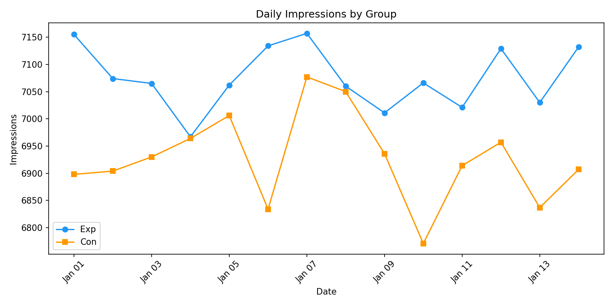
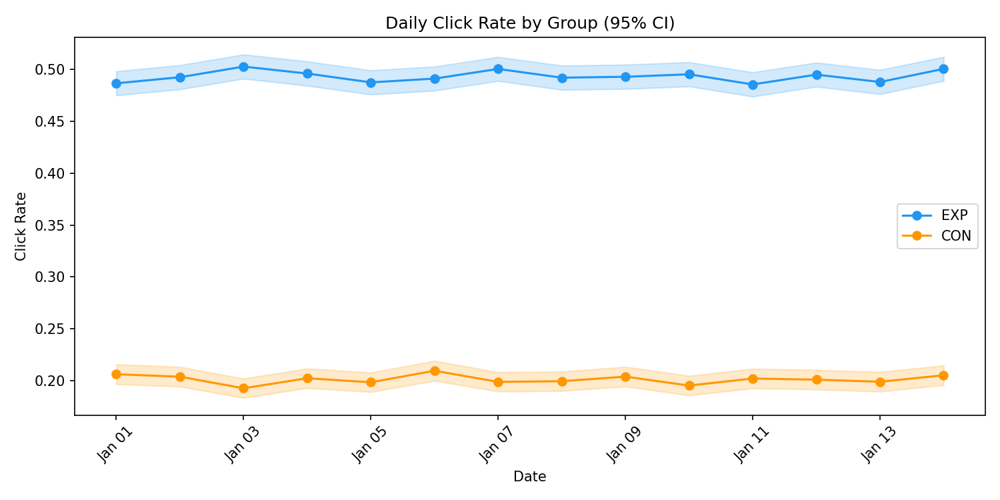
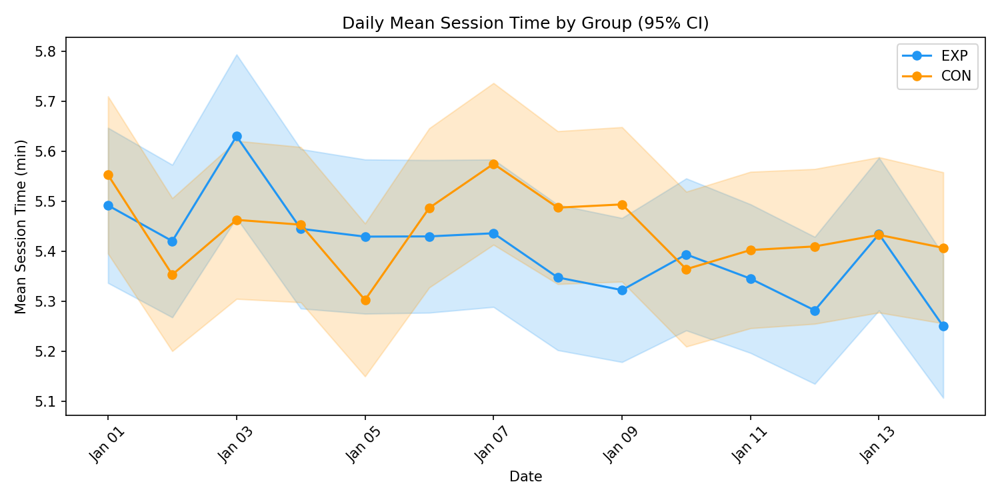
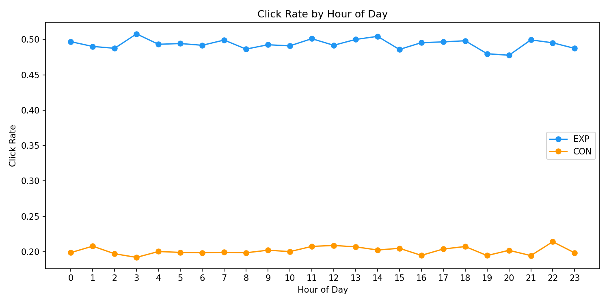
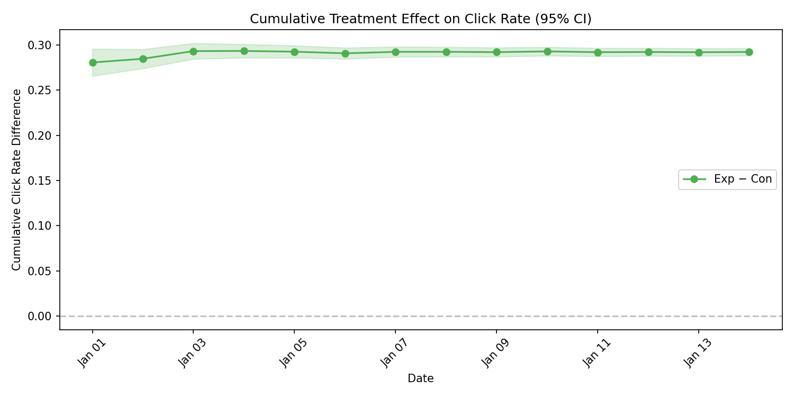
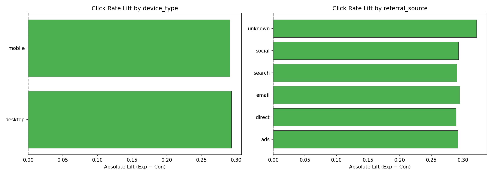
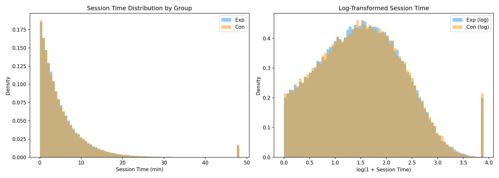
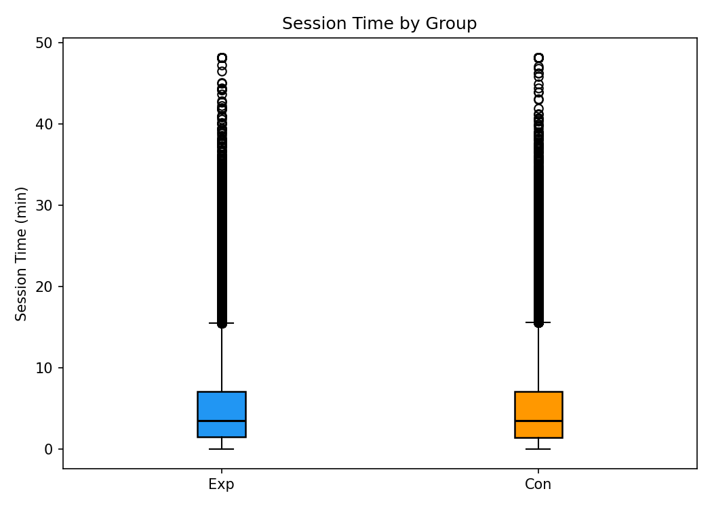
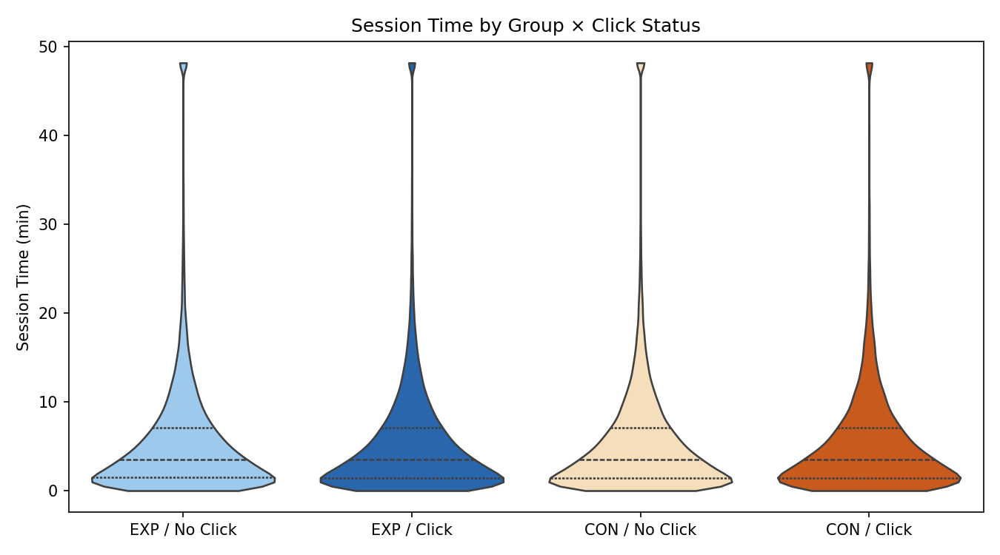

# A/B Test Analysis Report

**Generated**: 2026-02-24  
**Dataset**: data/cleaned.csv (198,019 rows, Jan 1–14 2024)  
**Groups**: Exp (n=100,017) / Con (n=98,002)

## 1. Experiment Health Check

### Sample Ratio Mismatch (SRM)

- Exp: 100,017 | Con: 98,002
- Chi-squared = 20.50, p = 0.0000
- **WARNING**: SRM detected (p < 0.01). The traffic split deviates significantly from 50/50. Investigate randomization.

### Covariate Balance

- **device_type**: Chi-squared = 0.53, p = 0.4646, Cramér's V = 0.0016
- **referral_source**: Chi-squared = 5.35, p = 0.3742, Cramér's V = 0.0052

Covariates are well-balanced across groups.

### Temporal Balance

Daily impression counts are stable across the experiment period.

## 2. Time-Series Stability

- Early lift (days 1–2): 0.2847
- Late lift (days 10–14): 0.2926
- Difference-in-differences: -0.0078, z = -1.22, p = 0.2223
- No significant novelty effect. The treatment effect appears stable over time.

## 3. Click Rate Results (Primary Metric)

### Unadjusted Analysis

| Metric | Value |
|---|---|
| Exp click rate | 0.4934 (49.3%) |
| Con click rate | 0.2012 (20.1%) |
| Absolute lift | 0.2922 (29.2%) |
| Relative lift | 145.2% |
| 95% CI for lift | [0.2882, 0.2962] |
| Z-statistic | 136.39 |
| p-value (z-test) | 0.00e+00 |
| p-value (chi-squared) | 0.00e+00 |
| Cohen's h | 0.6272 |

### Covariate-Adjusted Analysis (Logistic Regression)

| Metric | Value |
|---|---|
| Odds Ratio (Exp vs Con) | 3.8661 |
| 95% CI | [3.7898, 3.9439] |
| p-value | 0.00e+00 |

The experimental group has an odds ratio of **3.87**, meaning the odds of clicking are approximately 3.9x higher in the Exp group after adjusting for device type and referral source.

**Multiple testing**: Raw p = 0.00e+00. With Bonferroni correction (α = 0.025): **SIGNIFICANT**.

### Subgroup Analysis (Exploratory)

*Note: These are exploratory and not adjusted for multiple comparisons.*

**device_type**:

| Segment | Exp Rate | Con Rate | Lift | N |
|---|---|---|---|---|
| desktop | 0.4966 | 0.2031 | 0.2935 | 59,809 |
| mobile | 0.4920 | 0.2004 | 0.2916 | 138,210 |

**referral_source**:

| Segment | Exp Rate | Con Rate | Lift | N |
|---|---|---|---|---|
| ads | 0.4941 | 0.2023 | 0.2918 | 19,516 |
| direct | 0.4924 | 0.2032 | 0.2892 | 29,420 |
| email | 0.4924 | 0.1975 | 0.2949 | 49,129 |
| search | 0.4924 | 0.2020 | 0.2904 | 59,334 |
| social | 0.4962 | 0.2032 | 0.2930 | 39,638 |
| unknown | 0.5083 | 0.1867 | 0.3215 | 982 |

**Interaction test p-values** (does treatment effect vary by segment?):

- device_type_mobile: p = 0.9425
- referral_source_direct: p = 0.7672
- referral_source_email: p = 0.5476
- referral_source_search: p = 0.8975
- referral_source_social: p = 0.9455
- referral_source_unknown: p = 0.3000

## 4. Session Time Results (Secondary Metric)

### All Users

| Metric | Exp | Con | Difference |
|---|---|---|---|
| Mean (min) | 5.402 | 5.441 | -0.039 |
| Median (min) | 3.517 | 3.523 | -0.006 |

| Test | Statistic | p-value |
|---|---|---|
| Mann-Whitney U | 4897417190 | 7.82e-01 |
| Welch's t-test (log) | -0.44 | 6.62e-01 |
| OLS (log, adjusted) | coef = -0.0016 | 6.57e-01 |

- Bootstrap 95% CI for mean difference: [-0.096, 0.018]
- Bootstrap 95% CI for median difference: [-0.050, 0.039]

**Multiple testing**: Raw p = 7.82e-01. With Bonferroni correction (α = 0.025): not significant.

### Clickers Only

*Caveat: Conditioning on click=1 (a post-treatment outcome) introduces potential collider bias. Interpret with caution.*

| Metric | Exp | Con | Difference |
|---|---|---|---|
| N | 49,350 | 19,722 | — |
| Mean (min) | 5.368 | 5.408 | -0.040 |
| Median (min) | 3.498 | 3.489 | — |
| Mann-Whitney p | — | — | 6.85e-01 |
| Welch's t-test p (log) | — | — | 8.56e-01 |

### Conflicting Signals Check

- Click rate: Exp **higher** than Con (strong effect)
- Session time (all users): Exp **lower** than Con by 0.039 min
- **Potential quality concern**: Exp users click more but spend less time on the page. This could indicate lower engagement quality.

## 5. Combined Interpretation

The experiment tested whether the treatment (Exp group) increases click-through rate.

**Click rate**: The Exp group shows a statistically significant and practically meaningful increase in click-through rate (49.3% vs 20.1%, absolute lift = 29.2%). This effect survives Bonferroni correction and is confirmed by covariate-adjusted analysis (OR = 3.87).

**Session time**: No statistically significant difference in session time after Bonferroni correction.

## 6. Recommendation

**Recommendation**: **Ship the treatment.**

**Confidence level**: HIGH

The experimental treatment produces a clear, statistically significant increase in click-through rate of 29.2% (relative lift: 145%). The effect is stable over the 14-day observation window, consistent across device types and referral sources, and robust to covariate adjustment. 
Session time shows no significant difference, suggesting the treatment specifically impacts click behavior without degrading session quality.
