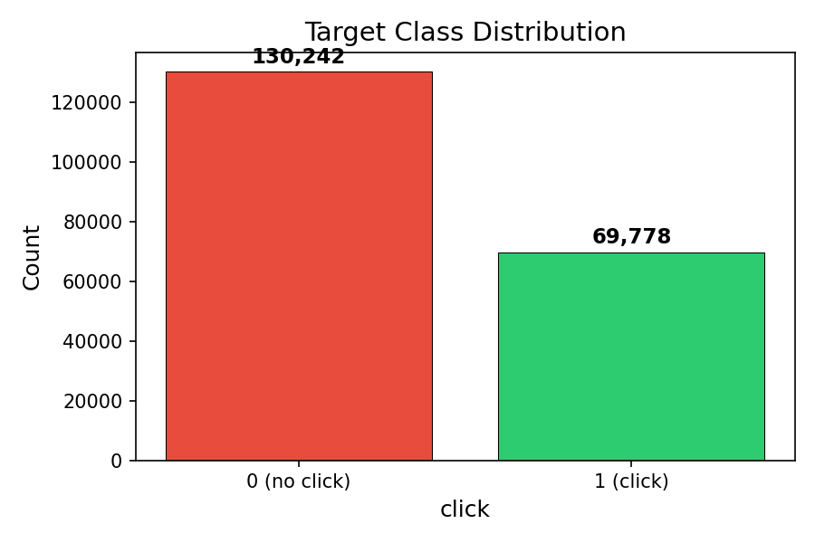
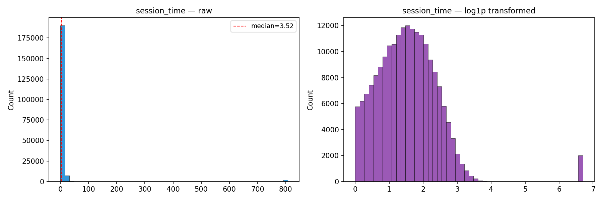
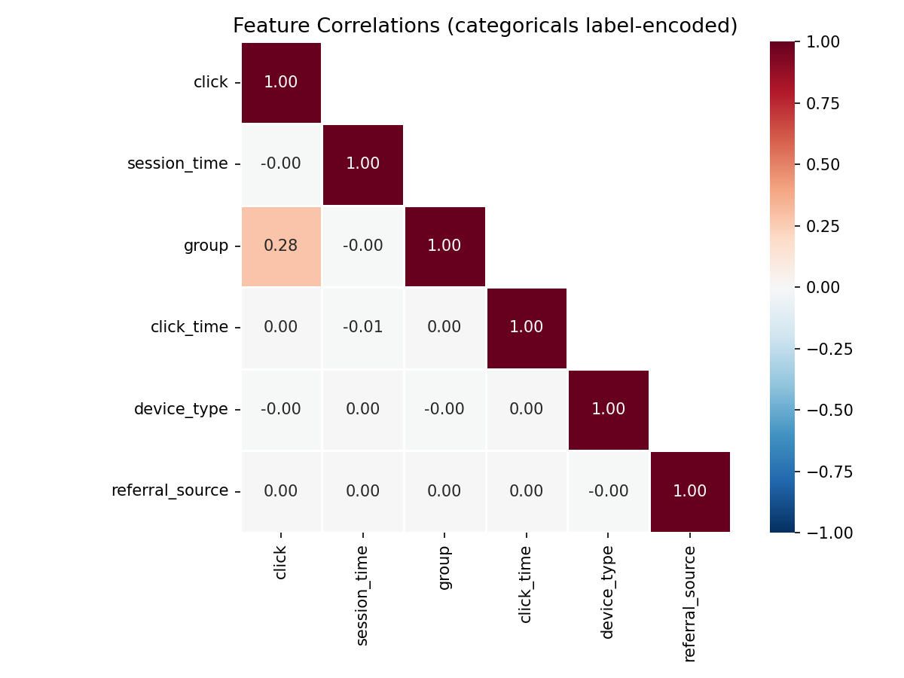

# EDA Summary

## Dataset
- **Rows**: 200,020
- **Columns**: 6

## Target Variable (`click`)
- Class 0 (no click): 130,242 (65.1%)
- Class 1 (click): 69,778 (34.9%)
- Imbalance ratio: 1.87:1

## Missing Values
- `group`: 1,970 (0.98%)
- `click_time`: 2,001 (1.00%)
- `referral_source`: 989 (0.49%)
- **Total**: 4,960

## Data Quality Issues
- 31 duplicate rows found.
- `group` has values with leading/trailing whitespace: ['con ', 'A '].
- `group` has casing/whitespace variants that map to 'exp': 'exp', 'Exp'.
- `group` has casing/whitespace variants that map to 'a': 'a', 'A '.
- `group` has casing/whitespace variants that map to 'con': 'con ', 'con'.
- `session_time` is highly skewed (skew=9.79, median=3.52, max=807.79). Consider log transform or capping.
- `session_time` has 3,604 extreme upper outliers (>23.98, 3x IQR fence).
- `device_type` has casing/whitespace variants that map to 'mobile': 'mobile', 'MOBILE'.
- `device_type` has casing/whitespace variants that map to 'desktop': 'desktop', 'Desktop'.
- `referral_source` has values with leading/trailing whitespace: [' Social '].
- `referral_source` has casing/whitespace variants that map to 'social': 'social', ' Social '.
- `referral_source` has possible typo: 'seach' vs 'search' (edit distance 1).

## Key Observations
- Click rate by group — 'a': 35.3%, 'con': 20.1%, 'exp': 49.6%.
- Continuous features: `session_time`.
- Categorical features: `group`, `click_time`, `device_type`, `referral_source`.
- `click_time` looks like a datetime string (100% parseable). Extract temporal features or drop.

## Plots

### Class Distribution

### Numerical Feature Distributions

### Correlation Heatmap

### Missing Value Patterns

